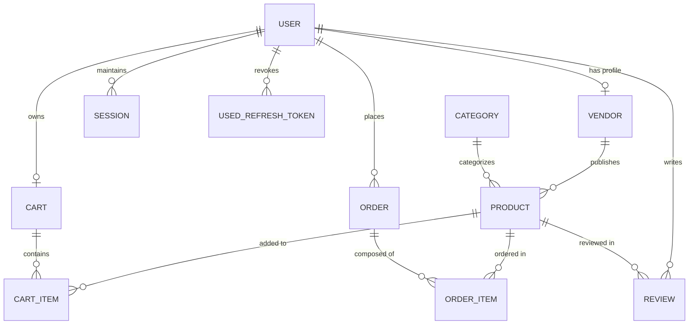
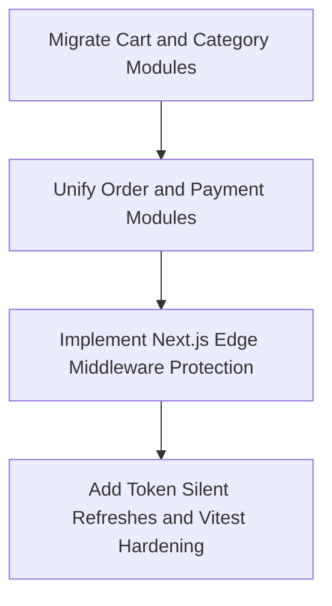

# AuraMarket — Technical Audit & Project Analysis

AuraMarket is a modern, high-fidelity **Enterprise-Grade Multivendor E-Commerce Platform** designed with a robust PostgreSQL + Prisma database, a high-performance Express.js backend, and a modern Next.js 16 (App Router) + React 19 frontend. 

This document provides a complete technical analysis, structural breakdown, and current state audit of your project.

---

## 1. Project Directory Structure

Below is an annotated map of the workspace. It highlights how the project is organized into `client` (Next.js frontend) and `server` (Express.js backend) layers, as well as auxiliary documentation files.

```
multivendor-ecommerce/
├── docs/                             # Architecture & migration runbooks
│   ├── 00-START-HERE.md              # Startup map and current progress
│   ├── ARCHITECTURE.md               # Target blueprint & design principles
│   ├── AUTH-IMPLEMENTATION-ORDER.md  # Step-by-step auth module code guide
│   ├── MIGRATION-PLAYBOOK.md         # Playbook for migrating legacy horizontal to vertical slices
│   └── PRODUCTS-SETUP.md             # Guide to seeding and migrating product domain
│
├── client/                           # Frontend application (Next.js 16 / React 19 / TS / Tailwind)
│   ├── src/
│   │   ├── app/                      # Next.js App Router (Routing and Pages)
│   │   │   ├── (auth)/               # Unauthenticated login/register route groups
│   │   │   │   ├── login/            # Page routing for User Sign-In
│   │   │   │   └── register/         # Page routing for User Registration
│   │   │   ├── cart/                 # Customer shopping cart routing
│   │   │   ├── checkout/             # Payment checkouts routing
│   │   │   ├── products/             # Product catalog & details routing
│   │   │   │   └── [id]/             # Dynamic details routing
│   │   │   ├── globals.css           # Global CSS variables & Tailwind config
│   │   │   └── layout.tsx            # Main layout wrapper
│   │   │
│   │   ├── features/                 # Vertical domain-driven slices (Core Logic)
│   │   │   ├── auth/                 # Authentication features (Login & registration forms, hooks)
│   │   │   ├── products/             # Product catalog grids, gallery, detail views, purchase panels
│   │   │   ├── cart/                 # Shopper cart views, quantity adjustments
│   │   │   └── marketing/            # Highly interactive homepage landing layout
│   │   │
│   │   ├── components/               # Shareable component library
│   │   ├── config/                   # Next/Axios configuration
│   │   ├── lib/                      # Third party integrations, custom client instance (e.g. Axios)
│   │   ├── store/                    # Global React State stores (e.g., Zustand)
│   │   └── providers/                # React Context Providers (TanStack Query, UI Themes)
│   │
│   ├── package.json                  # Next.js frontend package manager manifests
│   └── tsconfig.json                 # Next.js TypeScript rules
│
└── server/                           # Backend Application (Express 5 / TypeScript / Prisma)
    ├── prisma/                       # Database ORM definition and seeds
    │   ├── schema.prisma             # Core PostgreSQL model declarations and schemas
    │   └── seed.ts                   # Seed script for initial setup (Roles, Categories, Products)
    │
    ├── src/
    │   ├── app.ts                    # Core Express initialization, global middlewares, routing root
    │   ├── server.ts                 # Server listener startup process
    │   │
    │   ├── common/                   # Shared cross-cutting components
    │   │   ├── config/               # Environment variables parsed with Zod schemas
    │   │   ├── middlewares/          # Global error, validation, and request-tracing middlewares
    │   │   ├── utils/                # Async handler helpers, logger wrappers
    │   │   └── types/                # Global Express type extensions
    │   │
    │   ├── modules/                  # Vertical Feature Slices (Target Architecture)
    │   │   ├── auth/                 # Auth vertical slice (routes, services, DTOs, validations)
    │   │   ├── products/             # Product vertical slice (routes, controllers, serializers, services)
    │   │   ├── vendor/               # Vendor onboarding and store profiles vertical slice
    │   │   ├── cart/                 # Target folder for Cart (Pending Migration)
    │   │   ├── category/             # Target folder for Categories (Pending Migration)
    │   │   └── user/                 # Target folder for Users (Pending Migration)
    │   │
    │   └── [Legacy Horizontals]/     # Legacy flat structure layers to migrate:
    │       ├── routes/               # Cart, Category, Order, Payment, Webhook routes
    │       ├── controllers/          # Business logic handlers
    │       ├── services/             # Direct database transactions and integration logic
    │       └── validations/          # Endpoint payload validators (Zod schemas)
```

---

## 2. Technical Stack Audit

Both the frontend and backend are equipped with cutting-edge, high-performance web development frameworks and utility libraries:

### Frontend (Client)
*   **Core Framework**: Next.js `16.2.6` (App Router) & React `19.2.4` (using Server/Client Components architecture).
*   **Language**: TypeScript `5` for structural types.
*   **State Management**: `zustand` `^5.0.13` (lightweight, decoupled global state stores).
*   **Data Fetching**: `@tanstack/react-query` `^5.100.10` for cache management, query key invalidation, and request lifecycle handling.
*   **Styling & UI**: Tailwind CSS `4.0`, Framer Motion `12.38.0` for micro-animations, Shadcn UI `4.7.0` for custom tailorable primitives, and Lucide React icons.
*   **Form Management**: `react-hook-form` `^7.76.0` integrated with `@hookform/resolvers` & `zod` for real-time validation schemas.
*   **Communications**: `axios` `^1.16.1` for network calls with customizable interceptors.

### Backend (Server)
*   **Core Engine**: Express `5.2.1` using Native ES Modules (`"type": "module"`).
*   **Language**: TypeScript `6.0.3` running on `tsx` watch mode for developer environments.
*   **Database ORM**: Prisma `^7.8.0` with standard PostgreSQL adapter.
*   **Security & Guarding**: `helmet` `^8.1.0` (HTTP headers), `cors` `^2.8.6`, `express-rate-limit` `^8.5.1` (anti-DDoS rate-limiting), and `cookie-parser` `^1.4.7` (secure, httpOnly cookies).
*   **Hashing & JWT**: `bcrypt` `^6.0.0` for salted password storage, `jsonwebtoken` `^9.0.3` for stateless authorization.
*   **Integrations**: `ioredis` `^5.10.1` (Redis cache), `razorpay` `^2.9.6` (secure payment gateways).
*   **Utility & Performance**: `compression` `^1.8.1` (Gzip/Brotli payload compression) and `winston` `^3.19.0` (structured JSON logging).

---

## 3. Database Schema Overview (Prisma Blueprint)

The database schema is fully defined in `server/prisma/schema.prisma` and maps perfectly to postgresql. It is designed to handle multiple roles and relations.



### Core Entities & Models:
1.  **User**: Holds login credentials (`email`, hashed `password`), user status, and their authorization enum level (`CUSTOMER`, `VENDOR`, `ADMIN`).
2.  **Vendor**: Onboarding profile mapping 1:1 to a `User`. Contains business registration records (`gstNumber`, `storeName`, addresses, verification status, and enums `PENDING`, `APPROVED`, `REJECTED`, `SUSPENDED`).
3.  **Product**: Multivendor inventory item containing `price`, `stock`, `images`, and status (`DRAFT`, `ACTIVE`, `OUT_OF_STOCK`, `ARCHIVED`). References both `Vendor` and `Category`.
4.  **Category**: Flat taxonomical category map (`name`, unique web `slug`).
5.  **Cart & CartItem**: Fast user persistent shopping carts with composite unique indexing `[cartId, productId]` to avoid duplicate database inserts.
6.  **Order & OrderItem**: Purchase records linking `customer`, total sums, Razorpay identifiers (`razorpayOrderId`, `razorpayPaymentId`), shipping details, and order state status enums.
7.  **Sessions & UsedRefreshToken**: Hardened security structures built to support refresh token rotation, tracking used tokens to prevent replay hijacking.

---

## 4. Architecture Audit & Migration Status

Your architecture is currently in a **hybrid (transitional)** phase. You are successfully migrating from a horizontal layered layout into modern **domain-driven vertical slices** (each feature resides in a single folder). 

### Backend Component State:
*   **Vertical Slice (Feature Modules)** (Target):
    *   `modules/auth`: Fully Migrated ✅
    *   `modules/products`: Fully Migrated ✅
    *   `modules/vendor`: Fully Migrated ✅
*   **Legacy Horizontal Layers** (To Migrate next):
    *   `cart` (Controller, routes, validation, and services exist in root folders) ⚠️
    *   `category` (Controller, routes, validation, and services exist in root folders) ⚠️
    *   `orders` (Controller, routes, validation, and services exist in root folders) ⚠️
    *   `payments` (Controller, routes, validation, and services exist in root folders) ⚠️
    *   `webhooks` (Controller, routes, validation, and services exist in root folders) ⚠️

### Frontend Component State:
*   **Vertical Feature Slices**:
    *   `features/auth`: Fully structured login/register components and validation models. ✅
    *   `features/products`: Product grids, details views, skeletal loaders, and interactive components. ✅
    *   `features/cart`: Fully functional shopping cart sidebar view. ✅
    *   `features/marketing`: Outstanding highly-animated responsive homepage. ✅

---

## 5. Next Steps & Technical Recommendations

Based on the blueprints left in your `docs/` folder and an audit of your workspace, here is your prioritized technical action plan:



1.  **Migrate Legacy Core Domains (Cart & Category)**:
    *   Follow `docs/MIGRATION-PLAYBOOK.md` to package `cartController.ts`, `cartService.ts`, and `cartValidation.ts` into a self-contained vertical module: `server/src/modules/cart/`.
    *   Register the new vertical routers in the centralized registry: `server/src/routes/index.ts`.
2.  **Unify Order & Payment Flows**:
    *   Convert legacy `orderController.ts`, `paymentController.ts`, and `webhookController.ts` into individual `modules/orders`, `modules/payments`, and `modules/webhooks`.
3.  **Harden Frontend Routing & State**:
    *   Integrate Next.js client-side edge middlewares (`middleware.ts`) to intercept unauthorized navigation towards `/admin`, `/vendor`, or customer dashboard panels.
    *   Wire automatic refresh token silent background triggers inside your Axios client to ensure seamless sessions.
