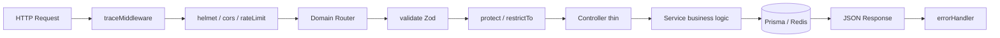

# AuraMarket Enterprise Architecture Blueprint

## 1. What you have today (honest audit)

### Backend — **Hybrid architecture**

```
┌─────────────────────────────────────────────────────────────┐
│  CROSS-CUTTING (shared by all domains)                      │
│  config/ · middlewares/ · utils/ · types/                   │
└─────────────────────────────────────────────────────────────┘
                              │
        ┌─────────────────────┴─────────────────────┐
        ▼                                           ▼
┌───────────────────┐                   ┌───────────────────────┐
│ VERTICAL SLICE    │                   │ HORIZONTAL LAYERS     │
│ modules/auth/     │                   │ routes/               │
│  (1 domain)       │                   │ controllers/          │
│                   │                   │ services/             │
│                   │                   │ validations/          │
│                   │                   │ (7 domains)           │
└───────────────────┘                   └───────────────────────┘
```

| Pattern | Where | Good for |
|---------|-------|----------|
| **Vertical slice (feature module)** | `server/src/modules/auth/` | Scaling teams, clear boundaries |
| **Horizontal layers** | `routes/`, `controllers/`, `services/` | Small apps; becomes painful at scale |

### Frontend — **Same hybrid**

| Done | Missing |
|------|---------|
| `features/auth/` | `features/products/`, `cart/`, `orders/`, etc. |
| `lib/api/axios.ts` | `lib/api/products.ts`, `orders.ts`, … |
| Auth pages | Dashboard, catalog, checkout UI |

---

## 2. Target architecture (what you are building toward)

### Principle: **Vertical slice per domain** + **thin shared core**

Each business domain owns its HTTP surface and business logic in **one folder**.

### Target backend tree

```
server/src/
├── app.ts                    # Wire middleware + register routes only
├── server.ts                 # Process entry
│
├── config/                   # Env, DB, Redis, Razorpay
├── middlewares/              # Global only (error, validate, trace, auth guards)
├── types/                    # express.d.ts extensions
├── utils/                    # catchAsync, logger, context
│
├── modules/                  # ← ALL domains live here eventually
│   ├── auth/
│   │   ├── auth.routes.ts
│   │   ├── auth.controller.ts
│   │   ├── auth.service.ts
│   │   ├── auth.validation.ts
│   │   └── auth.dto.ts
│   ├── products/
│   ├── categories/
│   ├── cart/
│   ├── orders/
│   ├── payments/
│   ├── vendors/
│   └── webhooks/
│
└── routes/
    └── index.ts              # Single place that mounts every module router
```

### Request flow (every domain)



### Target frontend tree

```
client/src/
├── app/                      # Routes only (thin pages)
│   ├── (public)/
│   ├── (auth)/
│   └── (protected)/
│       ├── customer/
│       ├── vendor/
│       └── admin/
│
├── features/                 # One folder per domain
│   ├── auth/
│   ├── products/
│   ├── cart/
│   ├── orders/
│   └── checkout/
│
├── components/ui/            # Design system (shadcn)
├── lib/api/                  # Axios + per-domain API functions
├── store/                    # Global client state (auth, ui)
├── providers/                # Query, auth hydration
└── middleware.ts             # Edge route protection (Next.js)
```

---

## 3. Layer responsibilities (never mix these)

| Layer | Responsibility | Must NOT do |
|-------|----------------|-------------|
| **Route** | URL, middleware chain, HTTP method | Business logic, Prisma |
| **Controller** | Read `req`, call service, set status/cookie, `res.json` | Complex queries, bcrypt |
| **Service** | Business rules, transactions, token logic | `res.send`, headers |
| **Validation** | Zod schemas, input shape | DB access |
| **Middleware** | Cross-cutting: auth, errors, trace | Domain rules |
| **Prisma** | Data access | Authorization decisions |

---

## 4. Build phases (do not skip order)

### Phase 0 — Foundation (you already have this)

- [x] `config/env.ts` — Zod env validation
- [x] `middlewares/errorMiddleware.ts` — `AppError` + global handler
- [x] `middlewares/validateMiddleware.ts`
- [x] `middlewares/traceMiddleware.ts`
- [x] `utils/catchAsync.ts`
- [x] `prisma/schema.prisma`

### Phase 1 — Auth vertical slice (you already have this)

Follow [AUTH-IMPLEMENTATION-ORDER.md](./AUTH-IMPLEMENTATION-ORDER.md) to study every file.

### Phase 2 — Route registry (cleanup `app.ts`)

- [x] `server/src/routes/index.ts` — mount all APIs in one function
- [ ] Later: each import points to `modules/<domain>/`

### Phase 3 — Migrate one flat domain (recommended: **products**) ✅

Use [MIGRATION-PLAYBOOK.md](./MIGRATION-PLAYBOOK.md).

Order of migration priority:

1. ~~`products`~~ — done (`server/src/modules/products/`, `client/src/features/products/`)
2. `cart` + `orders` — checkout flow (next)
3. `payments` + `webhooks` — keep raw body order in `app.ts`
4. `vendors` + `categories`
5. Delete empty `controllers/`, `services/`, `validations/` when all moved

### Phase 4 — Client feature parity

For each backend module, add:

```
features/<domain>/
  components/
  hooks/
  types/
  validations/   (if forms)
lib/api/<domain>.ts
app/(protected)/.../page.tsx   (thin)
```

### Phase 5 — Production hardening

- [ ] `client/middleware.ts` — protect `/admin`, `/vendor`
- [ ] Silent refresh on hydrate
- [ ] Vitest + Supertest for auth + payments
- [ ] OpenAPI or shared `packages/types` (optional monorepo)

---

## 5. API conventions (keep consistent)

### Success response

```json
{
  "success": true,
  "message": "Optional human message",
  "data": { }
}
```

### Error response

```json
{
  "success": false,
  "code": "INVALID_CREDENTIALS",
  "message": "Invalid email or password."
}
```

### Validation error (422)

```json
{
  "success": false,
  "code": "VALIDATION_ERROR",
  "message": "Request validation failed.",
  "errors": [{ "field": "body.email", "message": "..." }]
}
```

---

## 6. Security checklist (per new module)

- [ ] Zod validation on every mutating route
- [ ] `protect` on private routes
- [ ] `restrictTo` for role-specific routes
- [ ] Rate limit sensitive endpoints
- [ ] Never return passwords or refresh token raw value
- [ ] Use `catchAsync` in controllers (no unhandled promise rejections)

---

## 7. Team scaling rule

> **One domain = one folder = one PR mindset**

When adding “wishlist”, create `modules/wishlist/` (backend) and `features/wishlist/` (frontend). Do not add another file to a shared `controllers/` pile.
